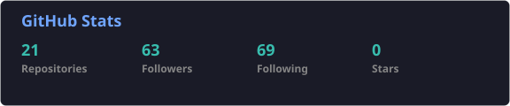

<!-- Animated Header -->

  

<h1 align="center">Hi there, I'm Deepak 👋</h1>

<strong>Full Stack Web Developer • Backend Developer • PERN Stack</strong>

  

  

---

## 💫 About Me

I'm a Full Stack Developer focused on building clean, scalable, and production-ready web applications.

- 💻 Full Stack Web Development
- ⚙️ Backend & REST API Development
- 🗄️ PostgreSQL, Prisma, MongoDB & Redis
- 🔐 Authentication & Authorization
- 🚀 Docker, Cloud & Deployment
- 🌱 Currently learning System Design & scalable backend architecture

---

## 🌐 Connect With Me

  
  
  
  
  
  
  

---
## 🛠️ Tech Stack

### 🚀 Languages

  
  
  

### 🎨 Frontend

  
  
  
  

### ⚙️ Backend

  
  
  
  
  

### 🗄️ Database & ORM

  
  
  
  

### ☁️ Cloud & DevOps

  
  
  
  
  

---

## 🚧 Currently Building

### 💼 QueueOS

A queue management platform focused on improving the waiting experience
through real-time updates and a clean digital workflow.

**Focus:** Real-time systems • APIs • Authentication • Database Design

---

### 💰 Expense Tracker AI

A modern expense management application for tracking income and expenses,
organizing spending, and understanding financial habits.

**Focus:** Next.js • TypeScript • PostgreSQL • Prisma • AI • Analytics

---

## 🚀 Featured Projects

---

## 📊 GitHub Stats

  

---

## 🐍 Contribution Graph

<picture>
  <source media="(prefers-color-scheme: dark)" srcset="https://raw.githubusercontent.com/deepakkandpal004/deepakkandpal004/output/github-contribution-grid-snake-dark.svg" />
  <source media="(prefers-color-scheme: light)" srcset="https://raw.githubusercontent.com/deepakkandpal004/deepakkandpal004/output/github-contribution-grid-snake.svg" />
  
</picture>

---

  <strong>💙 Thanks for visiting my profile!</strong>
   
  ⭐ Feel free to explore my repositories and connect with me.

  

