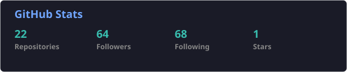

# Deepak Kandpal

**Full-Stack Developer (MERN)** — I build production-ready web apps with clean, scalable backends.

[Portfolio](https://deepakkandpal.me) · [LinkedIn](https://linkedin.com/in/deepakkandpal) · [Email](mailto:deepakkandpal.tech@gmail.com) · [Resume](https://deepakkandpal.me/resume.pdf)

---

### About

- Ex-SDE Intern @ **sevaSYNC Digital Solutions** (Jun – Aug 2026) — shipped client work across full-stack features
- Currently building **ResumeAI** — AI resume matcher with ATS scoring, JD tailoring, cover letters, and application tracking
- Previously shipped **Expense Tracker AI** (live), **Async Job Processing** (Redis worker queues), and a **URL Shortener**
- Open to work: Remote · Pune · Noida · Mumbai · Hyderabad · Gurgaon · Delhi NCR · Bangalore — immediate joiner

### Experience

**SDE Intern — sevaSYNC Digital Solutions** (Jun 2026 – Aug 2026)
- Built and shipped full-stack features for client projects in a consulting setup
- Worked across React frontends and Node.js/Express backends with real production data

### Stack

`TypeScript` `JavaScript` `React` `Next.js` `Node.js` `Express` `PostgreSQL` `Prisma` `MongoDB` `Redis` `Docker` `Tailwind CSS` `Git`

### Featured projects

| Project | What it does | Links |
|---|---|---|
| **ResumeAI** | AI resume builder — match your resume to a job description, ATS score, tailor bullets, generate cover letters, track applications | [Live](https://resume.deepakkandpal.me) · [Repo](https://github.com/deepakkandpal004/Resume-Builder-SaaS) |
| **Expense Tracker AI** | Track income and expenses, organize spending, and understand financial habits with analytics | [Live](https://expense.deepakkandpal.me) · [Repo](https://github.com/deepakkandpal004/next-expense-tracker) |
| **Async Job Processing** | Background job processing with Redis worker queues, retries, and PostgreSQL persistence (backend) | [Repo](https://github.com/deepakkandpal004/Async-job-processing) |
| **URL Shortener** | Fast, minimal URL shortener with a clean UI | [Live](https://url-shortener-lyart-two.vercel.app) · [Repo](https://github.com/deepakkandpal004/URL-Shortener) |

### Currently learning

System design and scalable backend architecture — queues, caching, and database design beyond the basics.

### Writing

I write about things I build and learn — [deepakkandpal.me/blog](https://deepakkandpal.me/blog)

### Stats

### Contribution graph

<picture>
  <source media="(prefers-color-scheme: dark)" srcset="https://raw.githubusercontent.com/deepakkandpal004/deepakkandpal004/output/github-contribution-grid-snake-dark.svg" />
  <source media="(prefers-color-scheme: light)" srcset="https://raw.githubusercontent.com/deepakkandpal004/deepakkandpal004/output/github-contribution-grid-snake.svg" />
  
</picture>
